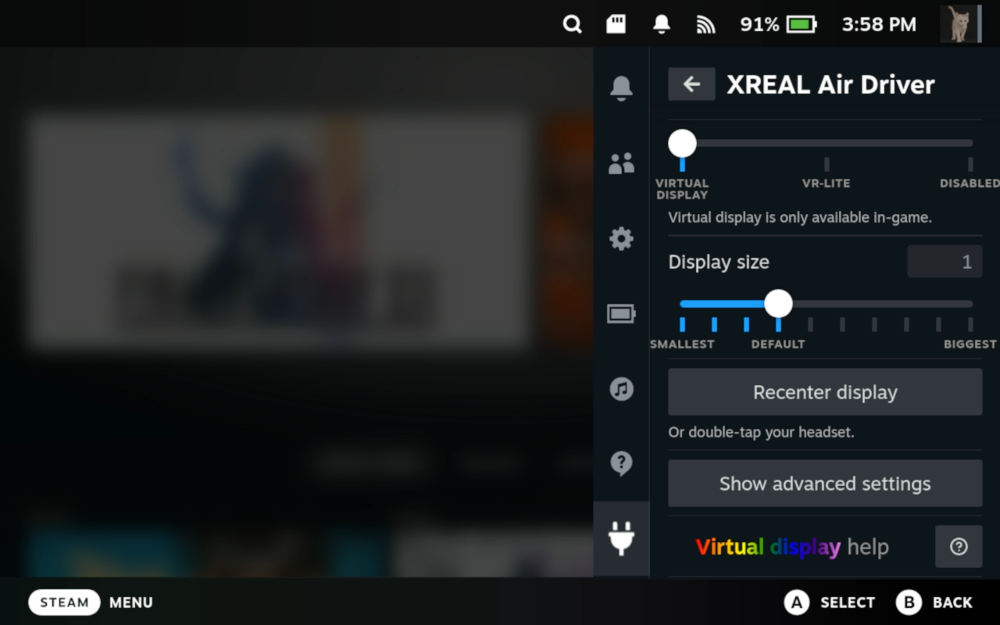

# XR Gaming Plugin
 

This plugin provides virtual display and head-tracking modes for the XREAL Air 1, 2, 2 Pro and VITURE One glasses by installing [Breezy Desktop's Vulkan implementation](https://github.com/wheaney/breezy-desktop). It also provides a UI for easily changing common configurations. All without leaving Game Mode.

For the moment, virtual display support only works for Vulkan games. See what's [in the works](#upcoming-features).

## How it works

This plugin installs and keeps you up-to-date with the latest version of Breezy. Going into the plugin settings allows you to disable Breezy or configure its behavior.

## Decky Controls

From the plugin sidebar, you can control the following:
* **Change headset modes**.
  * In [virtual display mode](#virtual-display-help), a display will be rendered in a fixed position, allowing you to move your head to look at different parts of the screen.
  * In [VR-lite mode](#vr-lite-mode), head movements are translated to mouse (or joystick) movements for a VR-like experience in first-person games.
  * In [Sideview mode](#sideview-mode), games can be moved to the corner of your screen, allowing you to pay attention to the world around you while gaming.
  * When disabled, your Air glasses will be display-only, no head movements will be tracked.
* **In Virtual Display mode**:
  * **Display size**. Controls how big the screen appears. A setting of 1 will render at the game's resolution, while a higher setting zooms in (e.g. 2 for 2x zoom) and lower zooms out (e.g. 0.5 for a 50% smaller screen).
  * **Recenter display** button. If you don't like where your virtual display has been placed, you can use this button or multi-tap to re-center it. See ["I don't like where the screen was placed, or it has drifted from where it was."](#i-dont-like-where-the-screen-was-placed-or-it-has-drifted-from-where-it-was) for more details.
  * Advanced Settings / **Movement look-ahead**. In virtual display mode, Breezy automatically attempts to anticipate where the screen will be when the next frame is rendered. If you find that its default look-ahead is producing a screen that drags behind your movements or a screen that is over-eager or jittery, you can tweak this yourself. The max is capped because higher values produce jitter and become unusable.
  * Advanced Settings / **Enable SBS mode**. This toggle switch will put your glasses in or out of SBS mode. When in SBS mode, your display resolution will double in width (to 3840x1080), and each eye will show only half of the screen to allow for stereoscopic-depth-based functionality. Turning this on will enable two new controls:
    * **Display distance**. Uses stereoscopic depth perception to move the display closer or farther from you. You may find that a different display distance reduces eye strain. A value greater than 1 is farther away (e.g. 2 is 2x farther than the glasses' default) and less than 1 is closer (e.g. 0.5 is half the default distance).
    * **Content is stretched**. Enable this if your device is rendering content using the entire width of the SBS screen. For a more consistent SBS experience across games, enable this toggle, then enable stretching by going to **the Deck's** `...` **Performance menu** and move the **Scaling Mode** slider to `Stretch`.
    * **Content is 3D**. Enable this if the game you're playing is rendering with side-by-side stereoscopic 3D support (either natively or using a third-party tool such as ReShade's Depth3D shader). This will render 3D content inside the virtual display.
* In **VR-lite mode**:
  * **Mouse sensitivity**. Controls how much/quickly the mouse will move relative to your head movements.
  * Advanced Settings / **Joystick mode**. When enabled, head movements are translated to right-joystick movements on a virtual controller (use this as [a fallback option](#enable-joystick-mode) if the default mouse mode controls don't work for your game).
* In **Sideview mode**:
  * **Display position**. Choose which corner of the screen to position your display.
  * **Display size**. Choose how much of the glasses screen should be taken up by the sideview display.
* Advanced Settings / **Recalibrate headset** button. If you're experiencing drift, noisiness, or a twisting/swaying of the screen when you move, you can use this button or multi-tap to try re-calibrating your headset. See ["I don't like where the screen was placed, or it has drifted from where it was."](#i-dont-like-where-the-screen-was-placed-or-it-has-drifted-from-where-it-was) for more details.

## Supported devices

| Brand    | Model             | Status            | Recommended?       | Notes                                                                                                                                   |
| -------- | ----------------- | ----------------- | ------------------ | --------------------------------------------------------------------------------------------------------------------------------------- |
| VITURE   | One               | **Live** (v0.6)  | :heavy_check_mark: | Official collaboration. [Closed source SDK available](https://www.viture.com/developer/viture-one-sdk-for-linux).                       |
| XREAL    | Air 1, 2, 2 Pro   | **Live**          | :x:                | Unwilling to collaborate. [Unofficial, open-source SDK](https://gitlab.com/TheJackiMonster/nrealAirLinuxDriver). Exhibits drift, noise. |
| Rokid    | Max               | *In development*  |                    | Official collaboration. SDK situation unknown.                                                                                          |
| TCL      | NXTWEAR           | Need POC**        |                    |                                                                                                                                         |
| Lenovo   | Legion Glasses    | Need POC**        |                    |                                                                                                                                         |

** If you're a rep from this company or know one, please reach out via any of [these channels](#stay-in-touch).

## Virtual display help

* [What does virtual display mode do?](#what-does-virtual-display-mode-do)
* [Will my game work?](#will-my-game-work)
* [Why isn't it working?](#why-isnt-it-working)
* [How can I optimize my setup for the best experience?](#how-can-i-optimize-my-setup-for-the-best-experience)
* [I don't like where the screen was placed, or it has drifted from where it was.](#i-dont-like-where-the-screen-was-placed-or-it-has-drifted-from-where-it-was)
* [The screen flickers a lot when I move.](#the-screen-flickers-a-lot-when-i-move)
* [I can see the screen shaking when I'm sitting still.](#i-can-see-the-screen-shaking-when-im-sitting-still)
* [The screen lags behind my head movements.](#the-screen-lags-behind-my-head-movements)
* [My screen is small when the display size is set to "1", or is using a lower resolution than my glasses.](#my-screen-is-small-when-the-display-size-is-set-to-1-or-is-using-a-lower-resolution-than-my-glasses)
* [SBS mode isn't working](#sbs-mode-isnt-working)

### What does virtual display mode do?
Typically, when you plug your glasses directly into the Steam Deck, you get a screen that stretches to fill your glasses entirely. And since that image is always centered in your lenses, no matter how you move your head, it will always remain centered in your vision. This forces you to look around the screen using only eye movements, which can be tiring on the eyes, and blurring on the edges of the screen means you can't always easily read content that's not near the center.

Virtual display mode is intended to mimic how we play games in real life: we place a TV screen or monitor in front of us, and then we're free to look around naturally with a combination of head and eye movements. When you enable this mode and launch into a Vulkan game, a screen will be placed in front of you like always, but now it will stay where you put it and you're free to look around how you naturally would.

### Will my game work?
Right now there's no surefire way to tell since this mode only supports Vulkan games, some libraries like **dxvk** make it possible for non-Vulkan games to go through Vulkan, it can be difficult to find a definitive list of all games running on Vulkan, and some apps like Heroic launcher may prevent a game that would otherwise work in theory from working in practice. [This issue](https://github.com/wheaney/decky-XRGaming/issues/6) proposes a solution that would allow people to run the plugin without glasses connected and tell if it will work. Add a thumbs-up to the issue if you would find that useful.

### Why isn't it working?
Virtual display mode only works under certain conditions. Double-check the following:
* Are you **using the XREAL/NREAL Air or VITURE One glasses**? XREAL Air 1, 2, and 2 Pro and VITURE One models *are* supported, but XREAL Light is *not*, nor are models from other brands, but soon this will include a wider range of devices. See the [upcoming features](#upcoming-features) section.
* Are your **glasses plugged into your Steam Deck**? Are they **displaying content when games aren't running**? 
  * Sometimes the display on the glasses will turn off as the battery level goes down. You can verify this by hitting the `Steam` or `...` buttons, since the Game Mode menus display no matter where the virtual screen is. If the glasses have powered down, try lowering your TDP wattage setting in the Performance panel to get more play time.
* Have you **selected the "Virtual display" headset mode** in the plugin settings? Mouse, joystick, and disabled settings will all disable the virtual display.
* Are you **playing a Vulkan game**? Currently only Vulkan is supported.
* Is your **game running locally** (not streaming over Moonlight, Steam Link, etc...)? Remote gaming is probably a no-go for now.
* Is your **screen not fixed somewhere else** in the room (e.g. due to changing positions or screen drift)? Maybe try re-centering your screen (see below).
* Is the game running in Steam and **not through an app installed via Flatpak**? Heroic launcher's Flatpak install, for example, may require extra setup or may not work at all.
  * Try your games before writing them off, as many launchers still work.

### How can I optimize my setup for the best experience?
Since there will always be a delay between your head movements and rendering of the display, the virtual display mode uses "look-ahead" logic to try to figure out where your head *will be* when the next frame is rendered. The longer it takes to get a frame rendered in your glasses, the bigger the look-ahead will need to be, which means: lower accuracy of predictions (which will cause the screen to briefly shift away from its fixed position) and higher sensitivity to movements (which will produce more shaking). So our goal is to get that latency between collecting movement data and rendering a frame with that data as low as possible. To put it another way: we want to reduce input lag.

In general, these will have the biggest impact on input lag:
* Avoid upscaling by running at the glasses' native resolution (or native aspect ratio).
   * I found that upscaling was causing 5-10ms of additional rendering latency. I initially suspected that it was due to FSR, but in changing the Scaling setting to Linear I didn't see a noticeable improvement. For now, it seems most important to remove the upscaling step entirely.
* Render frames as soon as they're ready by disabling all forms of VSync.
* Increase framerate by maximizing performance settings of your games. If you want to choose a lower resolution to achieve this, be sure it's at the glasses' native aspect ratio.

Here are specific ways you can try to achieve that on the Steam Deck:
* In **Steam's Settings/Display dialog,** make sure the **Automatically set resolution** toggle is enabled.
* Prior to launching a game, in **the Game Details view** (where it shows the green "Play" button), click the **Settings** (cog) icon, go to the **Properties** view, and set the resolution to `Native`.
* In **the in-game Video/Graphics settings**, set the resolution to `1920x1080` (or any 16:9 aspect ratio), disable `VSync`, and set everything to lower-quality, higher-performance settings.
* In **the Deck's** `...` **Performance menu**, flip on `Disable Frame Limit` (I know it's confusing to "turn on" a feature that "turns off" something, but either way the switch should be flipped to the "on" position) and enable `Allow Tearing`.

After you make these changes, if the display is still either lagging behind or jumping ahead of your movements or exhibiting a lot of shakiness, go into the **XR Gaming** plugin settings and change the **Movement look-ahead** setting to `Min`, then slowly dial it up while moving your head until the display seems to most stable.

### I don't like where the screen was placed, or it has drifted from where it was.
Unfortunately, without an official SDK from XREAL, screen drift will probably remain an issue for the foreseeable future for the supported XREAL devices. The only workarounds for this currently are to either (a) keep re-centering it, or (b) try re-calibrating it. 

This section will suggest you either use buttons in the plugin sidebar or use the multi-tap functionality built into this driver. For multi-tap, use one finger to tap down on the top of your glasses by your template. Each tap should firm and sharp, with a split-second wait before the next, as it needs to detect a slight pause in between. The cadence should be more like knocking on a door than double-clicking a mouse. If multi-tap isn't working or you would prefer not to use it, use the suggested buttons instead. **Note: The device manufacturers did NOT build multi-tap support and have NOT condoned this practice; tap on your glasses at your own risk.**

To re-center your screen, either use the **Recenter display** button in the plugin sidebar, or perform a double-tap on your glasses.

To re-calibrate your screen,  either use the **Recalibrate headset** button in the **Advanced settings** of the plugin sidebar, or perform a triple-tap on your glasses. This will briefly display a static screen while it resets the device calibration

### The screen flickers a lot when I move.
Framerate is really important here, because individual frames are static, so moving your head quickly may produce a noticeable flicker as it moves the screen. Higher framerates will produce an overall better experience (less flicker and smoother follow), so consider optimizing your game settings for better performance when using this mode. See "[How can I optimize my setup for the best experience?](#how-can-i-optimize-my-setup-for-the-best-experience)" for other performance-related recommendations.

### I can see the screen shaking when I'm sitting still.
There seems to be a bug caused by the combo of XREAL + SteamDeck that causes the sensor data to be amplified/noisier when playing audio over the Steam Deck speakers. To fix this, try switching your audio output to `Air` (in the Steam Deck's **Settings**, go to **Audio**) and make sure audio is actually coming out of the speakers in your glasses. This will stabilize the sensor data, which should get rid of some of the shakiness and also get rid of re-centering and re-calibration false-positives (triggered even when you don't tap the glasses).

If you're still experiencing shaking, see "[How can I optimize my setup for the best experience?](#how-can-i-optimize-my-setup-for-the-best-experience)" for performance-related recommendations that may allow you to reduce the look-ahead setting.

### The screen lags behind my head movements.
Since a bigger look-ahead produces more shaking, the max look-ahead is capped pretty conservatively. For games around 30 FPS, screen drag will become more noticeable, below 30 FPS the drag and flicking during head movements will be even worse. Try optimizing your game settings for better performance to achieve a higher FPS. See "[How can I optimize my setup for the best experience?](#how-can-i-optimize-my-setup-for-the-best-experience)" for other performance-related recommendations.

### My screen is small when the display size is set to "1", or is using a lower resolution than my glasses.

If the screen appears very small in your view, you may be playing at the Deck screen's native resolution (1280x800), and not at the glasses' native resolution (1920x1080). To fix this:
1. Go to the game details in Steam, hit the Settings/cog icon, and open `Properties`, then for `Game Resolution` choose `Native`.
2. After launching the game, if it's still small, go into the game options, and in the graphics or video settings, change the resolution.

If you *WANT* to keep a low resolution, then you can just use the `Display size` slider to make the screen appear larger.

### SBS mode isn't working ###
For the most consistent experience across all games and graphics settings:
* Use stretched content. To do this, first enable stretching by going to **the Deck's** `...` **Performance menu** and move the **Scaling Mode** slider to `Stretch`. Then in the plugin's Decky sidebar, enable the **Content is stretched** toggle.
* In **Steam's Settings/Display dialog,** make sure the **Automatically set resolution** toggle is enabled.
* Prior to launching a game, in **the Game Details view** (where it shows the green "Play" button), click the **Settings** (cog) icon, go to the **Properties** view, and set the resolution to `Native`.

If you're seeing a different image in each eye:
* Make sure you're only using SBS mode while in-game. Steam menus and other non-game interfaces won't be properly displayed while in this mode.
* Be sure the plugin's mode is still set to `Virtual Display`.
* If your game is **NOT** 3D (this is most games), disable the **Content is 3D** toggle.
* If your game is 3D, enable the **Content is 3D** toggle.

If you enable SBS mode, the glasses turn off and never come back on, try updating your glasses' firmware.

## VR-Lite mode

When in VR-lite mode, the device movements are converted to mouse movements (by default), and should be recognized by any PC game that supports keyboard/mouse input. This will work most naturally for games where mouse movements is used to control "look"/camera movements. For point-and-click style games, you may want to disable the driver so your glasses act as just a simple display.

To adjust the sensitivity of mapping head movements to mouse movements, use the **Mouse sensitivity** slider.

If you're using keyboard and mouse to control your games, then the mouse movements from this driver will simply add to your own mouse movements and they should work naturally together.

If you're using a game controller, Valve pushes pretty heavily for PC games support mouse input *in addition to* controller input, so you should find that most modern games will just work with this driver straight out of the box.

If your game doesn't support blending mouse and controller movement well, the best option may be to convert your controller's input to keyboard and mouse. Read on for how to do this for Steam and non-Steam games.

### Steam

1. Open your game's controller configuration in Steam
2. Open the Layouts view
3. Choose a keyboard/mouse template (e.g. "Keyboard (WASD) and Mouse"). Be sure to edit the configuration and set "Gyro Behavior" to "As Mouse" for any games where you want to use gyro.

### Non-Steam

You'll probably want to use a utility that does what Steam's controller layouts are doing behind the scenes: mapping controller buttons, joystick, and gyro inputs to keyboard/mouse inputs. One popular tool is [JoyShockMapper](https://github.com/Electronicks/JoyShockMapper).

### Enable joystick mode

One last alternative if mouse input just won't work is to enable the driver's joystick mode. Enable this using the **Use joystick** toggle. This will create a virtual gamepad whose right joystick is driven by movements from the glasses. This is less ideal because joystick movements are technically capped (you can only move a joystick so far...) and because it's a *second* controller on your PC. If the game you're trying to play is okay being driven by two controllers, then this may work, but if your game interprets another controller as a second player then its movements won't get combined with your real controller's movements.

## Sideview mode

When in Sideview mode, the display will shrink into one corner of the screen. Using the **Display position** menu, you can choose between top/bottom + left/right corners. The **Display size** slider allows you to choose how much of the glasses screen should be taken up by the sideview display; as little as 20%, up to 100% of the native screen size.

### Sideview mode isn't working

Sideview mode has the same constraints as Virtual display mode. See [Why isn't it working?](#why-isnt-it-working) in the Virtual display help section.

## Upcoming features
So much more is already in the works for this plugin! If you're enjoying it and any of the upcoming features sound appealing, or if you have a feature request, please consider [becoming a supporter](https://ko-fi.com/wheaney).

Upcoming features:
* Increased device support (Rokid, etc...).
* Virtual display for all of Game Mode, not just Vulkan games.
* General Linux virtual display support for productivity.
* Smooth follow mode

## Stay in touch

To keep up on the latest news, discuss, get help, report bugs, etc... you can follow along on [Reddit](https://www.reddit.com/user/watercanhydrate/), [Ko-fi](https://ko-fi.com/wheaney), [Github](https://github.com/wheaney), or join the [LinuXR Discord server](https://discord.gg/aJT72wKpXn).

## Uninstalling

If you wish to completely remove the installation, run the following: `sudo ~/bin/breezy_vulkan_uninstall`. For Steam Deck users, you can uninstall the plugin via the Decky interface, but you'll still need to manually run the terminal command from Desktop Mode to complete the uninstall until [this Decky feature request](https://github.com/SteamDeckHomebrew/decky-loader/issues/536) is addressed.

## Decky Loader

This plugin requires [Decky Loader](https://github.com/SteamDeckHomebrew/decky-loader), and is available for free on the Decky store.
