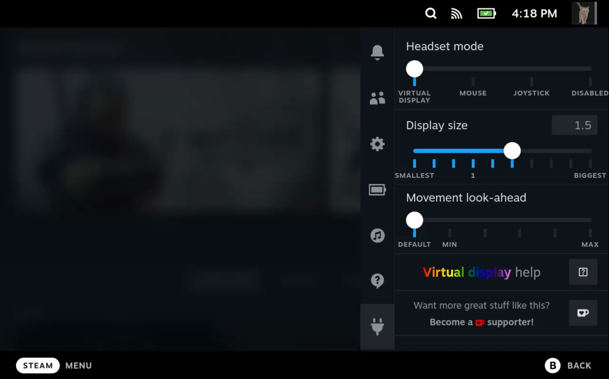

# XREAL Air Driver
 

This plugin provides virtual display and head-tracking modes for the XREAL Air glasses by installing [Breezy Vulkan](https://github.com/wheaney/breezy-desktop/tree/vulkan). It also provides a UI for easily changing common configurations. All without leaving Game Mode.

For the moment, virtual display support only works for Vulkan games. See what's [in the works](#upcoming-features).

## How it works

This plugin installs and keeps you up-to-date with the latest version of Breezy. Going into the plugin settings allows you to disable Breezy or configure its behavior.

## Configuration Options

From the plugin settings, you can control the following:
* **Enable/disable the driver**. When disabled, your Air glasses will be display-only, no head movements will be tracked.
* **Change headset modes**. In [virtual display mode](#virtual-display-help), a display will be rendered in a fixed space, allowing you to move your head to look at different parts of the screen. In [mouse-mode](#mouse-mode), head movements are translated to mouse movements, while in joystick-mode, they're translated to right-joystick movements on a virtual controller (use this as [a fallback option](#enable-joystick-mode) if mouse mode doesn't work).
* **Mouse sensitivity**. In mouse-mode, this setting controls how much/quickly the mouse will move relative to your head movements.
* **Display size**. In virtual display mode, this setting controls how big the screen appears. A setting of 1 will render at the game's resolution, while a higher setting zooms in (e.g. 2 for 2x zoom) and lower zooms out (e.g. 0.5 for a 50% smaller screen). 
* **Movement look-ahead**. In virtual display mode, Breezy automatically attempts to anticipate where the screen will be when the next frame is rendered. If you find that its default look-ahead is producing a screen that drags behind your movements or a screen that is over-eager or jittery, you can tweak this yourself. The max is capped because higher values produce jitter and become unusable.

## Virtual display help

* [What does virtual display mode do?](#what-does-virtual-display-mode-do)
* [Why isn't it working?](#why-isnt-it-working)
* [I don't like where the screen was placed, or it has drifted from where it was.](#i-dont-like-where-the-screen-was-placed-or-it-has-drifted-from-where-it-was)
* [The screen flickers a lot when I move.](#the-screen-flickers-a-lot-when-i-move)
* [I can see the screen shaking when I'm sitting still.](#i-can-see-the-screen-shaking-when-im-sitting-still)
* [The screen lags behind my head movements.](#the-screen-lags-behind-my-head-movements)
* [My screen is small when the display size is set to "1", or is using a lower resolution than my glasses.](#my-screen-is-small-when-the-display-size-is-set-to-1-or-is-using-a-lower-resolution-than-my-glasses)

### What does virtual display mode do?
Typically, when you plug your glasses directly into the Steam Deck, you get a screen that stretches to fill your glasses entirely. And since that image is always centered in your lenses, no matter how you move your head, it will always remain centered in your vision. This forces you to look around the screen using only eye movements, which can be tiring on the eyes, and blurring on the edges of the screen means you can't always easily read content that's not near the center.

Virtual display mode is intended to mimic how we play games in real life: we place a TV screen or monitor in front of us, and then we're free to look around naturally with a combination of head and eye movements. When you enable this mode and launch into a Vulkan game, a screen will be placed in front of you like always, but now it will stay where you put it and you're free to look around how you naturally would.

### Why isn't it working?
Virtual display mode only works under certain conditions. Double-check the following:
* Are you **using the original XREAL or NREAL Air glasses**? Air 2 and Pro models aren't supported, nor are models from other brands, but hopefully one day this will include a wider range of devices. See the [upcoming features](#upcoming-features) section.
* Are your **glasses plugged into your Steam Deck**? Are they **displaying content when games aren't running**? 
  * Sometimes the display on the glasses will turn off as the battery level goes down. You can verify this by hitting the `Steam` or `...` buttons, since the Game Mode menus display no matter where the virtual screen is. If the glasses have powered down, try lowering your TDP wattage setting in the Performance panel to get more play time.
* Have you **selected the "Virtual display" headset mode** in the plugin settings? Mouse, joystick, and disabled settings will all disable the virtual display.
* Are you **playing a Vulkan game**? Currently only Vulkan is supported.
* Is your **game running locally** (not streaming over Moonlight, Steam Link, etc...)? Remote gaming is probably a no-go for now.
* Is your **screen not fixed somewhere else** in the room (e.g. due to changing positions or screen drift)? Maybe try re-centering your screen (see below).
* Is the game running in Steam and **not through an app installed via Flatpak**? Heroic launcher's Flatpak install, for example, may require extra setup or may not work at all.
  * Try your games before writing them off, as many launchers still work.

### I don't like where the screen was placed, or it has drifted from where it was.
You'll want to use the multi-tap functionality built into this driver. **Note: XREAL did NOT build this feature and has NOT condoned this practice; tap on your glasses at your own risk.**

To re-center your screen, give two decent taps on the top of the glasses. Each tap should firm and sharp, with a split-second wait before the next, as it needs to detect a slight pause in between. The cadence should be more like knocking on a door than double-clicking a mouse.

Unfortunately, screen drift will probably remain an issue for the foreseeable future. The only workarounds for this currently are to either (a) keep re-centering it, or (b) try re-calibrating it by doing a triple-tap; this will briefly display a static screen while it resets the device calibration.

### The screen flickers a lot when I move.
Framerate is really important here, because individual frames are static, so moving your head quickly may produce a noticeable flicker as it moves the screen. Higher framerates will produce an overall better experience (less flicker and smoother follow), so consider optimizing your game settings for better performance when using this mode.

### I can see the screen shaking when I'm sitting still.
The virtual display uses "look-ahead" logic to try to figure out where your head <i>will be</i> when the next frame is rendered. For lower frame-rates, it has to look further ahead, so your movements are amplified more. There are a couple potential fixes for this:
* Try optimizing your game settings for better performance to achieve a higher FPS.
* Go into the plugin settings and manually override <b>Movement look-ahead</b>, lower values should produce less shaking.

### The screen lags behind my head movements.
Since a bigger look-ahead produces more shaking, the max look-ahead is capped pretty conservatively. For games around 30 FPS, screen drag will become more noticeable, below 30 FPS the drag and flicking during head movements will be even worse. Try optimizing your game settings for better performance to achieve a higher FPS.

### My screen is small when the display size is set to "1", or is using a lower resolution than my glasses.

If the screen appears very small in your view, you may be playing at the Deck screen's native resolution (1280x800), and not at the glasses' native resolution (1920x1080). To fix this:
1. Go to the game details in Steam, hit the Settings/cog icon, and open `Properties`, then for `Game Resolution` choose `Native`.
2. After launching the game, if it's still small, go into the game options, and in the graphics or video settings, change the resolution.

If you *WANT* to keep a low resolution, then you can just use the `Display size` slider to make the screen appear larger.

## Mouse mode

When in mouse mode, the device movements are converted to mouse movements, and should be recognized by any PC game that supports keyboard/mouse input. This will work most naturally for games where mouse movements is used to control "look"/camera movements. For point-and-click style games, you may want to disable the driver so your glasses act as just a simple display.

To adjust the sensitivity of mapping head movements to mouse movements, use the Decky UI on Steam Deck, or `~/bin/xreal_driver_config --mouse-sensitivity 20` via the terminal.

If you're using keyboard and mouse to control your games, then the mouse movements from this driver will simply add to your own mouse movements and they should work naturally together.

If you're using a game controller, Valve pushes pretty heavily for PC games support mouse input *in addition to* controller input, so you should find that most modern games will just work with this driver straight out of the box.

If your game doesn't support blending mouse and controller movement well, the best option may be to convert your controller's input to keyboard and mouse. Read on for how to do this for Steam and non-Steam games.

### Steam

1. Open your game's controller configuration in Steam
2. Open the Layouts view
3. Choose a keyboard/mouse template (e.g. "Keyboard (WASD) and Mouse"). Be sure to edit the configuration and set "Gyro Behavior" to "As Mouse" for any games where you want to use gyro.

### Non-Steam

You'll probably want to use a utility that does what Steam's controller layouts are doing behind the scenes: mapping controller buttons, joystick, and gyro inputs to keyboard/mouse inputs. One popular tool is [JoyShockMapper](https://github.com/Electronicks/JoyShockMapper).

### Enable joystick mode

One last alternative if mouse input just won't work is to enable the driver's joystick mode, using the Decky UI on Steam Deck, or `~/bin/xreal_driver_config --use-joystick` via the terminal (you can revert this with `--use-mouse`). This will create a virtual gamepad whose right joystick is driven by movements from the glasses. This is less ideal because joystick movements are technically capped (you can only move a joystick so far...) and because it's a *second* controller on your PC. If the game you're trying to play is okay being driven by two controllers, then this may work, but if your game interprets another controller as a second player then its movements won't get combined with your real controller's movements.

## Upcoming features
So much more is already in the works for this plugin! If you're enjoying it and any of the upcoming features sound appealing, or if you have a feature request, or if you want to join the Discord, please consider [becoming a supporter](https://ko-fi.com/wheaney).

Upcoming features:
* Add support for XREAL Air 2/Pro glasses
* 3D SBS support for virtual display depth to make the display appear closer or farther away for eye comfort.
* 3D SBS content virtual display support: render 3D content in a body-anchor display.
* Virtual display for all of Game Mode, not just Vulkan games.
* General Linux virtual display support for productivity.
* Sideview and smooth follow modes?
* Other XR hardware (Rokid, etc...)

## Uninstalling

If you wish to completely remove the installation, run the following: `sudo ~/bin/breezy_vulkan_uninstall`. For Steam Deck users, you can uninstall the plugin via the Decky interface, but you'll still need to manually run the terminal command from Desktop Mode to complete the uninstall until [this Decky feature request](https://github.com/SteamDeckHomebrew/decky-loader/issues/536) is addressed.

## Decky Loader

This plugin requires [Decky Loader](https://github.com/SteamDeckHomebrew/decky-loader). XREAL Air Driver is available on the store.

## Steam Deck Homebrew Discord

